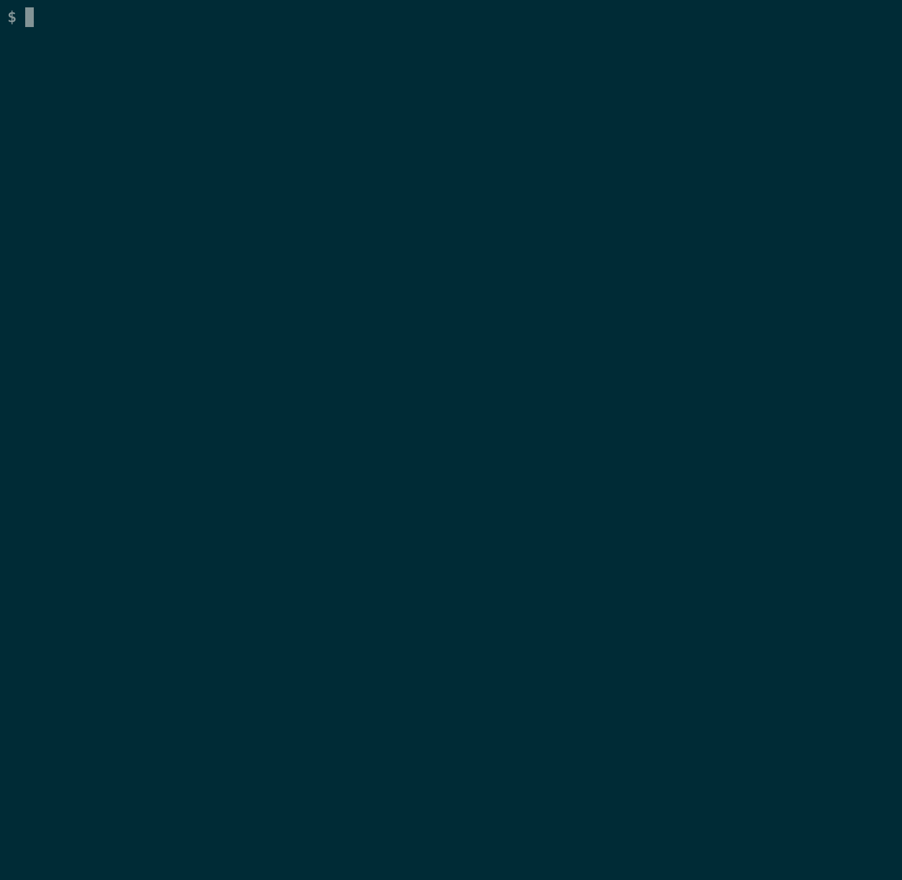
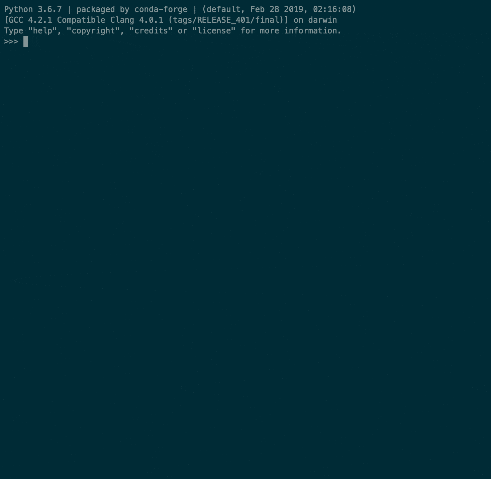

# MicroHapDB

[![MicroHapDB build status][cibadge]](https://github.com/bioforensics/MicroHapDB/actions)
[![Install with bioconda][condabadge]](http://bioconda.github.io/recipes/microhapdb/README.html)
[![BSD licensed][licensebadge]](https://github.com/bioforensics/MicroHapDB/blob/master/LICENSE.txt)

NBFAC, 2018-2022
https://github.com/bioforensics/microhapdb

**MicroHapDB** is a portable database intended for scientists and researchers interested in microhaplotypes for forensic analysis.
The database includes a comprehensive collection of marker and allele frequency data from numerous databases and published research articles.<sup>[5-20]</sup>
Effective number of allele (*A<sub>e</sub>*)<sup>[2]</sup> and informativeness for assignment (*I<sub>n</sub>*)<sup>[3]</sup> statistics are included so that markers can be ranked for different forensic applications.
The entire contents of the database are distributed with each copy of MicroHapDB, and instructions for adding private data to a local copy of the database are provided.
MicroHapDB is designed to be user-friendly for both practitioners and researchers, supporting a range of access methods from browsing to simple text queries to complex queries to full programmatic access via a Python API.
MicroHapDB is also designed as a community resource requiring minimal infrastructure to use and maintain.


## Installation

For best results, install from [bioconda](https://bioconda.github.io/).

```
conda install -c bioconda microhapdb
```

To make sure the package installed correctly:

```
conda install -y pytest
pytest --pyargs microhapdb --doctest-modules
```

Conda ensures the correct installation of Python version 3 and the [Pandas][] library, which are required by MicroHapDB.


## Usage

### Browsing

Typing `microhapdb marker` on the command line will print a complete listing of all microhap markers in MicroHapDB to your terminal window.
The commands `microhapdb population` and `microhapdb frequency` will do the same for population descriptions and allele frequencies.

> *__WARNING__: it's unlikely the entire data table will fit on your screen at once, so you may have to scroll back in your terminal to view all rows of the table.*

Alternatively, the files `marker.tsv`, `population.tsv`, and `frequency.tsv` can be opened in Excel or loaded into your statistics/datascience environment of choice.
Type `microhapdb --files` on the command line to see the location of these files.

### Database queries

The `microhapdb lookup <identifier>` command searches all data tables for relevant records with a user-provided name, identifier, or description, such as `mh06PK-24844`, `rs8192488`, or `Yoruba`.

The `microhapdb marker <identifier>` command searches the microhap markers with one or more user-provided names or identifiers.
The command also supports region-based queries (such as `chr1` or `chr12:1000000-5000000`), and can print either a tabular report or a detailed report.
Run `microhapdb marker --help` for additional details.

The `microhapdb population <identifier>` command searches the population & cohort table with one or more user-provided names or identifiers.
Run `microhapdb population --help` for additional details.

The `microhapdb frequency --marker <markerID> --population <popID> --allele <allele>` command searches the allele frequency table.
The search can be restricted using all query terms (marker, population, and allele), or broadened by dropping one or more of the query terms.
Run `microhapdb frequency --help` for additional details.



### Python API

To access MicroHapDB from Python, simply invoke `import microhapdb` and query the following tables.

- `microhapdb.markers`
- `microhapdb.populations`
- `microhapdb.frequencies`

Each is a [Pandas][]<sup>[1]</sup> dataframe object, supporting convenient and efficient listing, subsetting, and query capabilities.



See the [Pandas][] documentation for more details on dataframe access and query methods.

MicroHapDB also includes 4 auxiliary tables, which may be useful in a variety of scenarios.

- `microhapdb.variantmap`: contains a mapping of dbSNP variants to their corresponding microhap markers
- `microhapdb.idmap`: cross-references external names and identifiers with internal MicroHapDB identifiers
- `microhapdb.sequences`: contains the sequence spanning and flanking each microhap locus
- `microhapdb.indels`: contains variant information for markers that include insertion/deletion variants


## Ranking Markers

MicroHapDB provides three criteria for ranking markers.

- `Ae`: the marker's effective number of alleles (*A<sub>e</sub>*) computed individually for 26 populations<sup>[2]</sup>; by default, the average of the 26 populations is shown, but the `--ae-pop` flag or the `microhapdb.set_ae_population` function can be used to specify a single population for with to display A<sub>e</sub> values
- `In`: Rosenberg's informativeness for assignment (*I<sub>n</sub>*) computed on 26 populations<sup>[3]</sup>
- `Fst`: fixation index (*F<sub>ST</sub>*) computed on 26 populations<sup>[4]</sup>

The A<sub>e</sub> statistic is a measure of the *within-population* allelic variation at a locus, which corresponds to the marker's diagnostic power for identification purposes.
The I<sub>n</sub> and F<sub>ST</sub> statistics measure *between-population* allelic variation at a locus, which corresponds to the marker's utility for predicting population of origin.
Phased genotypes for 2,504 individuals from Phase 3 of the 1000 Genomes Project<sup>[14]</sup> are used to calculate these statistics.


## Adding Markers to MicroHapDB

> *I have some private microhap markers.
> Is it possible to include these in my MicroHapDB queries without making them public?*

Certainly!
See the [dbbuild](dbbuild/) directory for instructions on updating a private copy the database with additional sources of data.

> *I have published (or am getting ready to publish) a new panel of microhap markers and allele frequencies.
> Could you add these to MicroHapDB?*

Certainly!
The instructions in the [dbbuild](dbbuild/) directory describe what data files are required.
We would be happy to assist getting data into the correct format if that would help—just let us know by opening a thread on [MicroHapDB's issue tracker](https://github.com/bioforensics/MicroHapDB/issues/new).

> *My favorite data set of population-level genomic variation is not available in MicroHapDB.
> Could you add it?*

We would be happy to consider including any data set with compatible licensing or user agreements.
The [dbbuild](dbbuild/) directory describes the information required for marker and population definitions.
Computing allele frequencies from population data typically requires variant calls (VCFs) with phased genotypes for individuals.
Use [MicroHapDB's issue tracker](https://github.com/bioforensics/MicroHapDB/issues/new) to contact us with any questions about including new public data sets.


## Citation

If you use this database, please cite our work.

> Standage DS,  Mitchell RN (2020) MicroHapDB: A Portable and Extensible Database of All Published Microhaplotype Marker and Frequency Data. *Frontiers in Genetics* 11:781, [doi:10.3389/fgene.2020.00781](https://doi.org/10.3389/fgene.2020.00781).

MicroHapDB was created and is maintained by the Bioinformatics Group at the National Bioforensic Anaylsis Center (NBFAC).


----------


## References

### Supporting Software

<sup>[1]</sup>McKinney W (2010) Data structures for statistical computing in Python. *Proceedings of the 9th Python in Science Conference, 51-56*.

### Ranking Statistics

<sup>[2]</sup>Crow JF, Kimura M (1970) <u>An Introduction to Population Genetics Theory</u>. New York, Harper & Row.

<sup>[3]</sup>Rosenberg NA, Li LM, Ward R, Pritchard JK (2003) Informativeness of genetic markers for inference of ancestry. *American Journal of Human Genetics*, 73(6):1402–1422, [doi:10.1086/380416](https://doi.org/10.1086/380416).

<sup>[4]</sup>Weir B, Cockerham, C (1984) Estimating F-Statistics for the Analysis of Population Structure. *Evolution* 38(6):1358-1370, [doi:10.2307/2408641](https://doi.org/10.2307/2408641).

### Published Marker collections and Allele Frequency Data

<sup>[5]</sup>Rajeevan H, Soundararajan U, Kidd JR, Pakstis AJ, Kidd KK (2012) ALFRED: an allele frequency resource for research and teaching. *Nucleic Acids Research*, 40(D1): D1010-D1015, [doi:10.1093/nar/gkr924](https://doi.org/10.1093/nar/gkr924).

<sup>[6]</sup>Kidd KK, Pakstis AJ, Speed WC, Lagace R, Wootton S, Chang J (2018) Selecting microhaplotypes optimized for different purposes. *Electrophoresis*, [doi:10.1002/elps.201800092](https://doi.org/10.1002/elps.201800092).

<sup>[7]</sup>Kidd KK, Rajeevan H (2018) ALFRED data download. *The Allele Frequency Database*, https://alfred.med.yale.edu/alfred/selectDownload/Microhap_alleleF_198.txt. Accessed December 7, 2018.

<sup>[8]</sup>van der Gaag KJ, de Leeuw RH, Laros JFJ, den Dunnen JT, de Knijff P (2018) Short hypervariable microhaplotypes: A novel set of very short high discriminating power loci without stutter artefacts. *FSI: Genetics*, 35:169-175, [doi:10.1016/j.fsigen.2018.05.008](https://doi.org/10.1016/j.fsigen.2018.05.008).

<sup>[9]</sup>Staadig A, Tillmar A (2019) Evaluation of microhaplotypes—A promising new type of forensic marker. *The 28th Congress of the International Society for Forensic Genetics*, P597.

<sup>[10]</sup>Hiroaki N, Fujii K, Kitayama T, Sekiguchi K, Nakanishi H, Saito K (2015) Approaches for identifying multiple-SNP haplotype blocks for use in human identification. *Legal Medicine*, 17(5):415-420, [doi:10.1016/j.legalmed.2015.06.003](https://doi.org/10.1016/j.legalmed.2015.06.003).

<sup>[11]</sup>Chen P, Deng C, Li Z, Pu Y, Yang J, Yu Y, Li K, Li D, Liang W, Zhang L, Chen F (2019) A microhaplotypes panel for massively parallel sequencing analysis of DNA mixtures. *FSI: Genetics*, 40:140-149, [doi:10.1016/j.fsigen.2019.02.018](https://doi.org/10.1016/j.fsigen.2019.02.018).

<sup>[12]</sup>Voskoboinik L, Motro U, Darvasi A (2018) Facilitating complex DNA mixture interpretation by sequencing highly polymorphic haplotypes. *FSI: Genetics*, 35:136-140, [doi:10.1016/j.fsigen.2018.05.001](https://doi.org/10.1016/j.fsigen.2018.05.001).

<sup>[13]</sup>de la Puente M, Phillips C, Xavier C, Amigo J, Carracedo A, Parson W, Lareu MV (2020) Building a custom large-scale panel of novel microhaplotypes for forensic identification using MiSeq and Ion S5 massively parallel sequencing systems. *FSI: Genetics*, 45:102213, [doi:10.1016/j.fsigen.2019.102213](https://doi.org/10.1016/j.fsigen.2019.102213).

<sup>[14]</sup>Auton A, Abecasis G, Altshuler D, et al. (2015) A global reference for human genetic variation. *Nature* 526:68–74, [doi:10.1038/nature15393](https://doi.org/10.1038/nature15393).

<sup>[15]</sup>Gandotra N, Speed WC, Qin W, Tang Y, Pakstis AJ, Kidd KK, Scharfe C (2020) Validation of novel forensic DNA markers using multiplex microhaplotype sequencing. *FSI: Genetics*, **47**:102275, [doi:10.1016/j.fsigen.2020.102275](https://doi.org/10.1016/j.fsigen.2020.102275).

<sup>[16]</sup>Sun S, Liu Y, Li J, Yang Z, Wen D, Liang W, Yan Y, Yu H, Cai J, Zha L (2020) Development and application of a nonbinary SNP-based microhaplotype panel for paternity testing involving close relatives. *FSI: Genetics*, 46:102255, [doi:10.1016/j.fsigen.2020.102255](https://doi.org/10.1016/j.fsigen.2020.102255).

<sup>[17]</sup>Kureshi A, Li J, Wen D, Sun S, Yang Z, Zha L (2020) Construction and forensic application of 20 highly polymorphic microhaplotypes. *Royal Society Open Science*, **7**(5):191937, [doi:10.1098/rsos.191937](https://doi.org/10.1098/rsos.191937).

<sup>[18]</sup>Jin XY, Cui W, Chen C, Guo YX, Zhang XR, Xing GH, Lan JW, Zhu BF (2020) Developing and population analysis of a new multiplex panel of 18 microhaplotypes and compound markers using next generation sequencing and its application in the Shaanxi Han population. *Electrophoresis*, **41**(13-14):1230-1237, [doi:10.1002/elps.201900451](https://doi.org/10.1002/elps.201900451).

<sup>[19]</sup>Wu R, Li H, Li R, Peng D, Wang N, Shen X, Sun H (2021) Identification and sequencing of 59 highly polymorphic microhaplotypes for analysis of DNA mixtures. *International Journal of Legal Medicine*, 135:1137-1149, [doi:10.1007/s00414-020-02483-x](https://doi.org/10.1007/s00414-020-02483-x).

<sup>[20]</sup>Fan H, Xie Q, Wang L, Ru K, Tan X, Ding J, Wang X, Huang J, Wang Z, Li Y, Wang X, He Y, Gu C, Liu M, Ma S, Wen S, Qiu P (2022) Microhaplotype and Y-SNP/STR (MY): A novel MPS-based system for genotype pattern recognition in two-person DNA mixtures. *FSI: Genetics*, 59:102705, [doi:10.1016/j.fsigen.2022.102705](https://doi.org/10.1016/j.fsigen.2022.102705).

[alfred]: https://alfred.med.yale.edu/alfred/alfredDataDownload.asp
[Pandas]: https://pandas.pydata.org
[cibadge]: https://github.com/bioforensics/MicroHapDB/workflows/CI%20Build/badge.svg
[pypibadge]: https://img.shields.io/pypi/v/microhapdb.svg
[condabadge]: https://img.shields.io/badge/install%20with-bioconda-brightgreen.svg
[licensebadge]: https://img.shields.io/badge/license-BSD-blue.svg
